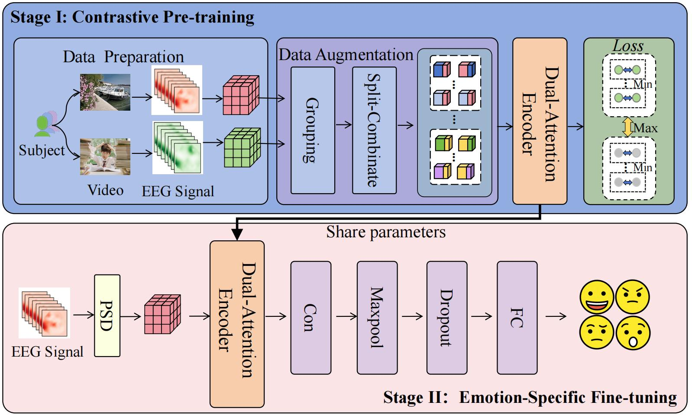

# SECLER

# Abstract

Electroencephalogram (EEG)-based emotion recognition systems face a persistent challenge: achieving robust performance in both cross-subject generalization and within-subject personalization simultaneously. Existing approaches often prioritize one paradigm while compromising the other cross-subject methods struggle to adapt to individual-specific neural signatures, whereas within-subject models require extensive personalized data. To bridge this gap, we propose CLDAE, a contrastive learning enhanced framework that integrates cross-subject EEG signal recombination with a dual-attention feature extraction mechanism.The framework operates in two stages: a contrastive learning pre-training stage and an emotion recognition fine-tuning stage. During pre-training, we employ a data augmentation method that combines EEG signals from different subjects to create new training samples, thereby increasing the accuracy of Cross-Subject and Within-Subject recognition.
A Dual-Attention Encoder, incorporating both temporal and channel attention mechanisms, is used to extract salient features from the augmented EEG data, capturing both time-domain and frequency-domain information enabling joint modeling of population-level invariants and individual discriminative features. The model is then fine-tuned on a labeled emotion dataset for recognition. Experiments on two public datasets the DEAP and SEED-IV and a private dataset MAN dataset demonstrate that CLDAE achieves competitive both within-subject and cross-subject emotion recognition accuracy (e.g.,94.78\% within-subject accuracy, 75.29\% cross-subject accuracy on MAN), outperforming baseline methods. These results validate that our framework is effective for dealing with both Within-Subject and Cross-Subject Emotion Recognition. Our code is available at https://github.com/liangyubuaa/CLDAE

## Requirements

- python 3.8
- For dependencies，see [requirements.txt](E:\pythonProject\CLDAE\requirements.txt)

## Reference
