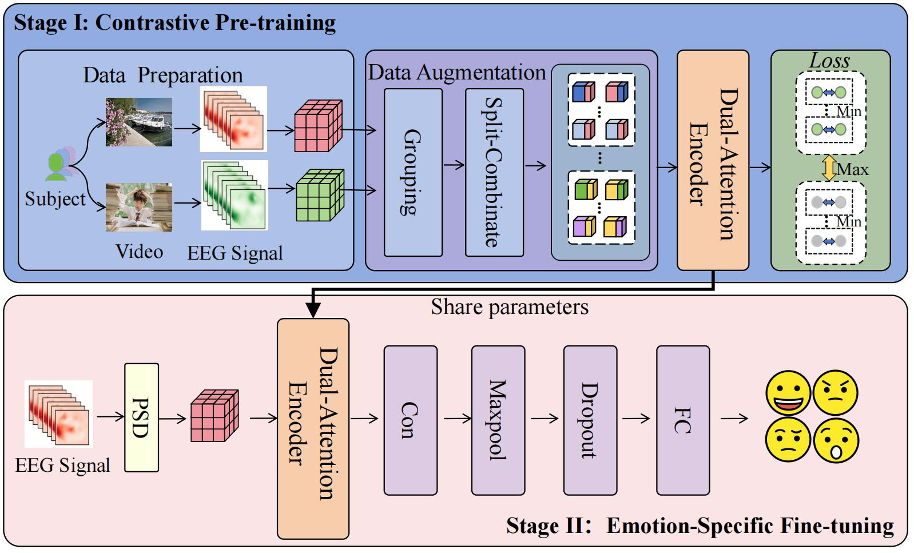

# CLDAE

This is an implementation of the DBET method, described in the following paper:

**CLDAE: A Two Stage EEG-based Emotion Recognition Framework Combining Contrastive Learning and Dual-Attention Encoder**



# Abstract

Electroencephalogram (EEG)-based emotion recognition systems face a persistent challenge in maintaining robust performance across subjects (generalization) and within subjects (personalization). Existing models for cross-subject recognition generally struggle to adapt to individual-specific neural signatures, while models with optimized within-subject performance typically require a large amount of personalized data. To address these limitations, this study proposes an EEG-based emotion recognition framework, CLDAE, that integrates a contrastive learning strategy and a dual-attention feature extraction mechanism. The CLDAE framework includes two stages: contrastive learning pre-training and emotion recognition fine-tuning. During the pre-training stage, a data augmentation method that combines EEG signals from different subjects is used to generate new training samples. Moreover, to extract discriminative features from the augmented data, the dual-attention encoder combines temporal and channel attention mechanisms. After pre-training, the CLDAE is fine-tuned for final recognition tasks. The proposed CLDAE is verified by experiments on two public datasets (DEAP and SEED-IV) and a private dataset (MAN). The experimental results demonstrate that the CLDAE achieves competitive performance in both within-subject and cross-subject emotion recognition, with 95.12% and 75.29% accuracy on the MAN dataset, respectively; thus, outperforming the baseline methods. These results validate the effectiveness of the proposed framework in both within-subject and cross-subject emotion recognition.


## Requirements

- python 3.8
- For dependencies，see [requirements.txt](./requirements.txt)
## Reference

```
@ARTICLE{11417405,
  author={Cao, Rongqi and He, Jian and Liang, Yu and Hu, Xiyuan and Peng, Tianhao and Wu, Wenjun and Niu, Shuang and Mumtaz, Shahid},
  journal={IEEE Journal of Biomedical and Health Informatics}, 
  title={CLDAE: A Two Stage EEG-based Emotion Recognition Framework Combining Contrastive Learning and Dual-Attention Encoder}, 
  year={2026},
  volume={},
  number={},
  pages={1-13},
  keywords={Electroencephalography;Brain modeling;Emotion recognition;Feature extraction;Adaptation models;Contrastive learning;Transformers;Data models;Accuracy;Training;EEG;Emotion Recognition;Contrastive Learning;Data Augmentation;Dual-attention encoder},
  doi={10.1109/JBHI.2026.3668381}}
```

